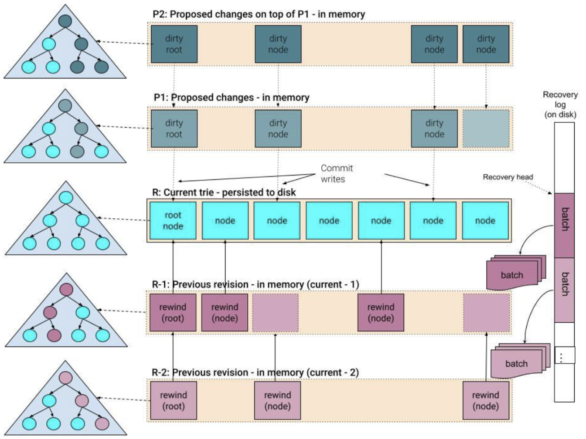
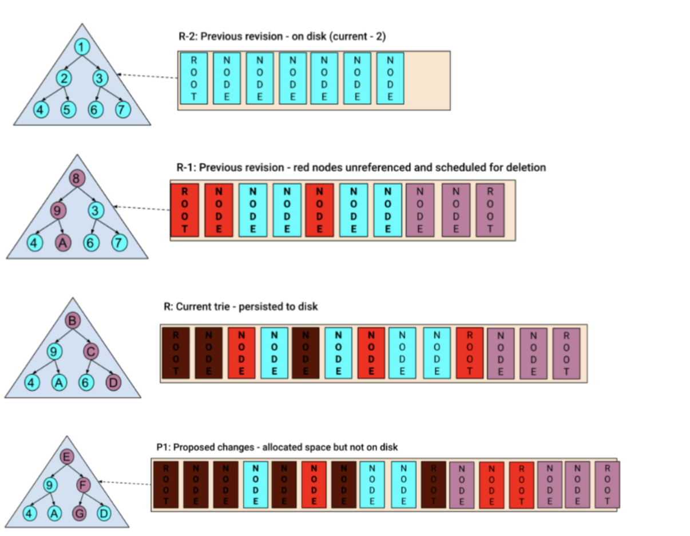
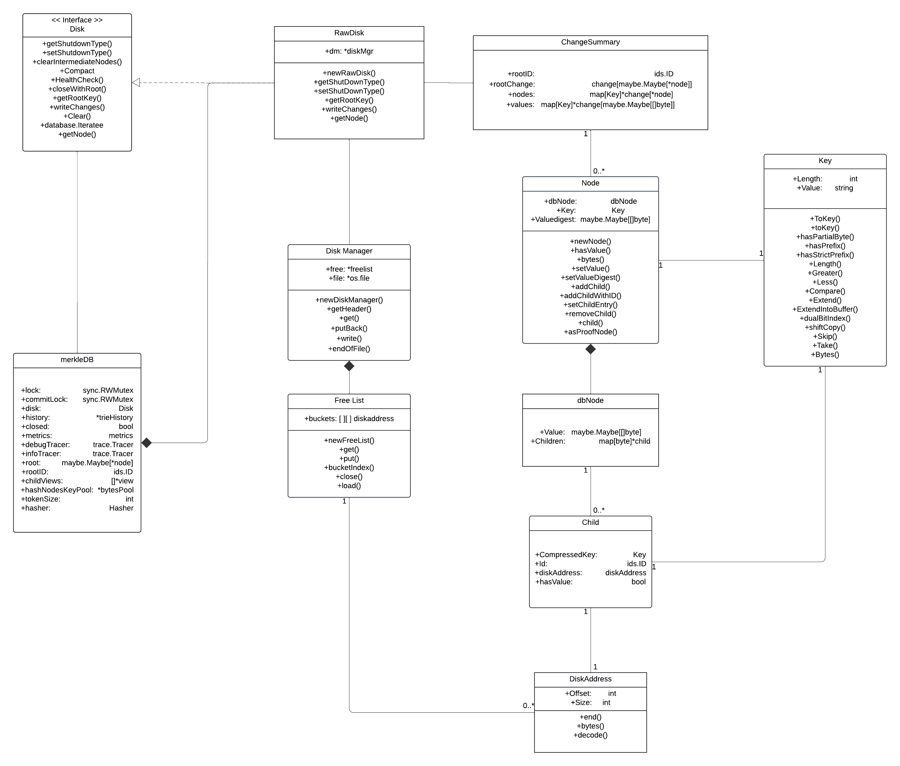
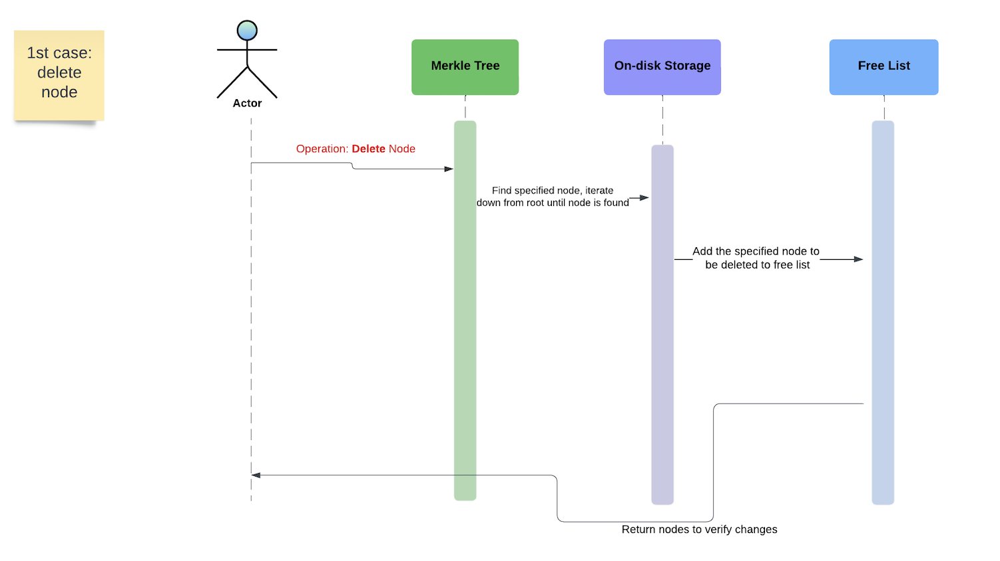
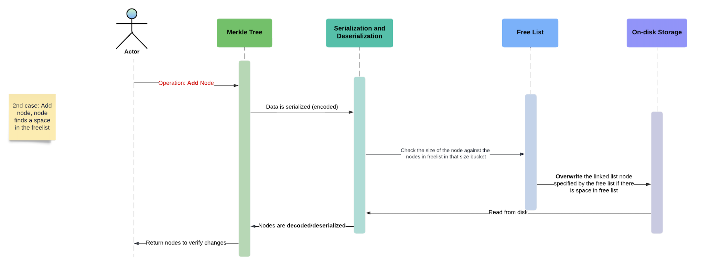
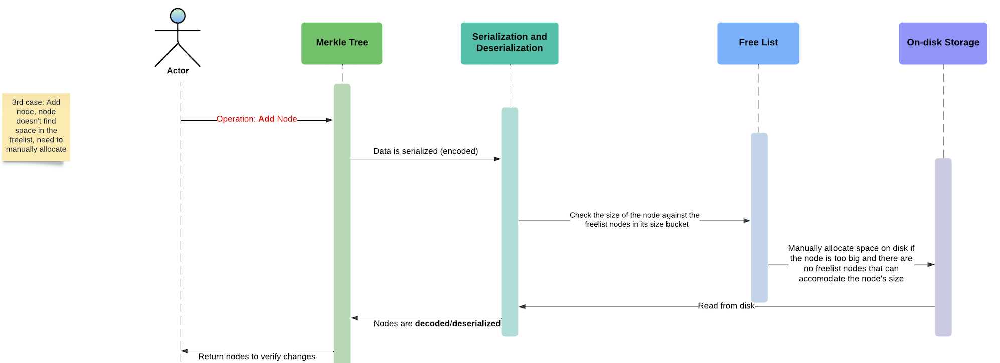
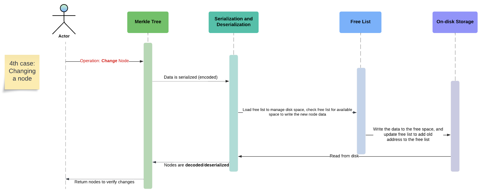

# Avalution

### Authors:

Adyah Rastogi, Hao Lee, Jiahua Ren, Justin Lang, Wesley Truong


### How to Build and Run Tests
**0. Download Golang & Git:**
- Follow instructions at the [official Go website download & install page](https://go.dev/doc/install) for your machine. 
- Download Git here: [Git install](https://git-scm.com/downloads)

**1. Clone the Repository using the editor of your choice or Terminal** <br>
First, clone the project repository to your local machine using Git:

```
git clone git@github.com:jlang61/avalution.git
```
This will create a local copy of the repository in a folder named avalution.

**2. Navigate to the Project Folder** <br>
Once the repository is cloned, navigate into the project directory:

```
cd avalution/x/merkledb
```
**3. Run Tests** <br>
To run the tests for the project, execute the following command:

```
go test
```
This will run all the test files in the current directory and its subdirectories. You should see output indicating whether the tests passed or failed.


## Introduction:

### Problem Statement:

Merkle trees currently use databases such as LevelDB and RocksDB to store authenticated key value pairs. However, this adds another level of complexity to the system as the storage options are stacked on top of each other. This issue is significant as 80% of the time spent in blockchains are retrieving data. Therefore, any optimization on this part can greatly impact a cryptocurrency’s usage. Additionally, Golang is the preferred language in terms of blockchain companies, and even though this problem is solved via Rust, there are no implementations of this solution in Golang.

### Background

In the world of cryptocurrency, blockchain is the fundamental technology driving the existence and innovation of current cryptocurrencies such as Bitcoin and Ethereum. Blockchain is a decentralized, distributed digital ledger technology that stores data transparently and securely. 

Conventionally, this data is stored in data structures known as Merkle Tries, where data is hashed and kept within the leaf nodes of a tree, and then combined with other sibling hashes recursively until reaching the Merkle root. Thus, by changing the data within one node, its hash will change and the change will propagate throughout the rest of the tree, making its way to the root and displaying a different hash. This property allows for fast verification of data by comparing hashes and identifying where changes occur, ensuring data integrity and security.

These Merkle trees are often stored on top of a generic database such as LevelDB or RocksDB, which have their own generic structure for how data is organized. Thus, the issue here is that these databases are different tree-like data structures themselves, and so further computation is required to transform the Merkle tree to fit the database.

In blockchains, low latency and fast verification are at the forefront of requirements to maintain the integrity of the network and prevent issues such as double-spending. If verification is slow, it would open the door to potential security vulnerabilities, such as malicious actors exploiting the delay to manipulate transactions. The amount of computation done is another factor as well, as oftentimes blockchain resides on light clients or mobile devices without the privilege of intense computation power.

To combat this, we recognize that Merkle trees have an implicit structure themselves, and so our goal is to circumvent the database portion entirely and store the Merkle tree on disk, leveraging the existing Merkle tree structure. On top of this, there are many potential speed-ups and optimizations that can be done when storing on-disk, and so we hope to further leverage these opportunities to create a low-latency blockchain platform.

### Project Specifics

Our project seeks to enhance the underlying architecture of the Avalanche blockchain by optimizing how key-value pairs of Merkle trees are stored directly on disk, moving beyond conventional database solutions like LMDB, LevelDB, and RocksDB. By developing and refining critical components such as the disk manager, free list, and revision manager, we aim to streamline the storage of recent Merkleized blockchain states, significantly reducing overhead and improving efficiency in state management.

### Science and Core Technical Advancements

Contrasting to databases used by Merkle Trees, if an on-disk implementation were to be created, there are multiple optimization options available for increasing performance and decreasing latency. Io_uring is a potential option to create multiple calls at once through their asynchronous read and write operations. Freelist can utilize a power of 2 algorithm for more efficient memory allocation and easier indexing. Our project plans to compete with current Merkle Trees/Databases to improve system performance and be faster at key-value requests.

### Assumptions

As we work on the project, we have a core set of assumptions made about the project itself. We assume that Firewood is an implementation of our current issue, but since Golang is the preferred coding language for blockchain applications, we are modifying AvalancheGo (a similar version of Firewood in Go) to be on disk.

### System Architecture Overview:




### UML Diagram:


### Sequence Diagrams:






### Technologies Employed:

Rust

Golang

Firewood

AvalancheGo Merkle DB

Merkle Trees

LMDB - B+ Tree Based Database

LMDBX - LMDB used by Erigon and Reth Ethereum Execution Clients
