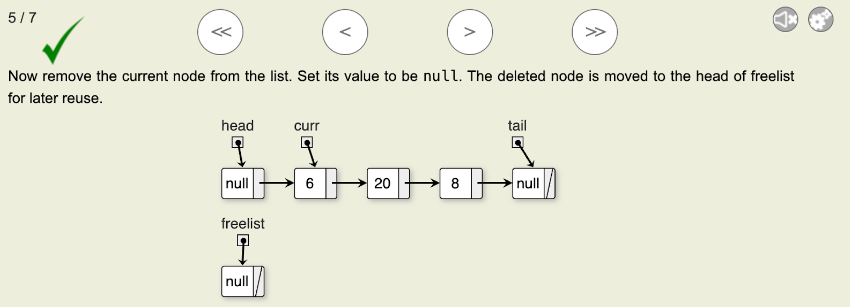
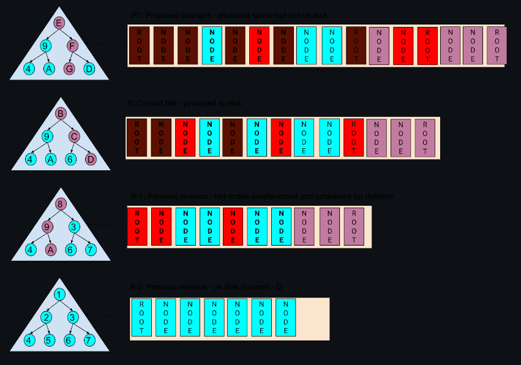

# Free List High Level Spec

## Free list - linked list of nodes 

- Example of a linked list of “in use” data and freelist 
- When a node from the “in use” data is deleted, we add that node to the freelist and make its value null. 
- This way when we want to add another node, we use the first/current node in the freelist, change its data, and add it to the linked list  

## To insert a new value 

- First: Check if there is a node in the free list 
- Second: Use the same node or create a new node 
- Third: Add to the linked list 

## Plan for utilizing freelist in firewood

- Store the serialization and a pointer to the on disk storage on its own node 
- Instead of current linked list for in use data, whenever we call delete on a specific node (can prob do with the btrfs and ext4), we actually read the data and find where it is store 

- In this case, we removed a node and added it to the freelist by changing the pointers in both the linked list and the free list 

### Purpose and Goals

Purpose of a free list is to make memory allocation easier and faster as new memory will not have to be allocated for new data. 

## Scope

### In scope

Functionality in the scope will be views of merkle trees that are discarded/old with nodes of the trees also discarded. 

## Components:

### Nodes

- Nodes in a free list will be the primary way for memory to be stored.
- Nodes will also have a value associated with them which will be null when in the free list, and changed to an actual value when added to the merkle tree 
- Nodes also have a pointer for the next node. 

### Linked List

- A free list will be in a form of a linked list with stack functionality, “last in, first out” for faster changes to the merkle tree. 

### Size?

- If needed, the node should also contain another value which is the size of the memory that is allocated. This way, when a new value wants to be added, it should first iterate through the linked list to find a node that has its size or greater. 

### Operations:

- Create a Free List
- When a node is deleted from the merkle tree, add it to the free list 
- When a value wants to be added to the merkle tree, use the first node in the free list, change the value to the new value, then add it to the merkle tree. 

## How to decide whether or not a revision has expired

- separate component - os have memory address and same  
- In each revision - at theend of it go ahead and say that these are nodes added and deleted 
- Revision expires - no longer keep track , these nodes are deleted appoint, dis
