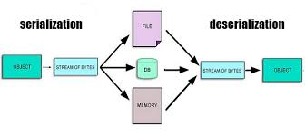

## Concept of Serialization

Serialization is translating an object like data structure into a format that can be easily stored, transmitted, or reconstructed later. The difference between just storing it as an object and storing on-disk: Think of a data structure like a binary tree, the nodes have pointers that point to scattered places in memory. To write it on disk we need to use a contiguous series of bytes rather than a long one with holes which would cause fragmentation. Therefore we need a way to serialize it into some bytes and then we can store it. This also means it has to be deserializable so we can retrieve it later. 

## Serialization in MerkleDB
The goal of the project is to switch from using a database to store nodes and instead just use on-disk. This removes the need for a database which would improve the efficiency of the product. 

This is the current Serialization scheme to persist node data into the database:

Nodes are persisted in an underlying database. In order to persist nodes, we must first serialize them. Serialization is done by the `encoder` interface defined in `codec.go`.

The node serialization format is:

```
+----------------------------------------------------+
| Value existence flag (1 byte)                      |
+----------------------------------------------------+
| Value length (varint) (optional)                   |
+----------------------------------------------------+
| Value (variable length bytes) (optional)           |
+----------------------------------------------------+
| Number of children (varint)                        |
+----------------------------------------------------+
| Child index (varint)                               |
+----------------------------------------------------+
| Child compressed key length (varint)              |
+----------------------------------------------------+
| Child compressed key (variable length bytes)      |
+----------------------------------------------------+
| Child ID (32 bytes)                                |
+----------------------------------------------------+
| Child has value (1 bytes)                          |
+----------------------------------------------------+
| Child index (varint)                               |
+----------------------------------------------------+
| Child compressed key length (varint)              |
+----------------------------------------------------+
| Child compressed key (variable length bytes)      |
+----------------------------------------------------+
| Child ID (32 bytes)                                |
+----------------------------------------------------+
| Child has value (1 bytes)                          |
+----------------------------------------------------+
|...                                                 |
+----------------------------------------------------+
```

Where:
* `Value existence flag` is `1` if this node has a value, otherwise `0`.
* `Value length` is the length of the value, if it exists (i.e. if `Value existence flag` is `1`.) Otherwise not serialized.
* `Value` is the value, if it exists (i.e. if `Value existence flag` is `1`.) Otherwise not serialized.
* `Number of children` is the number of children this node has.
* `Child index` is the index of a child node within the list of the node's children.
* `Child compressed key length` is the length of the child node's compressed key.
* `Child compressed key` is the child node's compressed key.
* `Child ID` is the child node's ID.
* `Child has value` indicates if that child has a value.

For each child of the node, we have an additional:

```
+----------------------------------------------------+
| Child index (varint)                               |
+----------------------------------------------------+
| Child compressed key length (varint)               |
+----------------------------------------------------+
| Child compressed key (variable length bytes)       |
+----------------------------------------------------+
| Child ID (32 bytes)                                |
+----------------------------------------------------+
| Child has value (1 bytes)                          |
+----------------------------------------------------+
```

Note that the `Child index` are not necessarily sequential. For example, if a node has 3 children, the `Child index` values could be `0`, `2`, and `15`. 
However, the `Child index` values must be strictly increasing. For example, the `Child index` values cannot be `0`, `0`, and `1`, or `1`, `0`.

Since a node can have up to 16 children, there can be up to 16 such blocks of children data.

#### Example

Let's take a look at an example node. 

Its byte representation (in hex) is: `0x01020204000210579EB3718A7E437D2DDCE931AC7CC05A0BC695A9C2084F5DF12FB96AD0FA32660E06FFF09845893C4F9D92C4E097FCF2589BC9D6882B1F18D1C2FC91D7DF1D3FCBDB4238`

The node's key is empty (its the root) and has value `0x02`.
It has two children.
The first is at child index `0`, has compressed key `0x01` and ID (in hex) `0x579eb3718a7e437d2ddce931ac7cc05a0bc695a9c2084f5df12fb96ad0fa3266`.
The second is at child index `14`, has compressed key `0x0F0F0F` and ID (in hex) `0x9845893c4f9d92c4e097fcf2589bc9d6882b1f18d1c2fc91d7df1d3fcbdb4238`.

```
+--------------------------------------------------------------------+
| Value existence flag (1 byte)                                      |
| 0x01                                                               |
+--------------------------------------------------------------------+
| Value length (varint) (optional)                                   |
| 0x02                                                               |
+--------------------------------------------------------------------+
| Value (variable length bytes) (optional)                           |
| 0x02                                                               |
+--------------------------------------------------------------------+
| Number of children (varint)                                        |
| 0x04                                                               |
+--------------------------------------------------------------------+
| Child index (varint)                                               |
| 0x00                                                               |
+--------------------------------------------------------------------+
| Child compressed key length (varint)                               |
| 0x02                                                               |
+--------------------------------------------------------------------+
| Child compressed key (variable length bytes)                       |
| 0x10                                                               |
+--------------------------------------------------------------------+
| Child ID (32 bytes)                                                |
| 0x579EB3718A7E437D2DDCE931AC7CC05A0BC695A9C2084F5DF12FB96AD0FA3266 |
+--------------------------------------------------------------------+
| Child index (varint)                                               |
| 0x0E                                                               |
+--------------------------------------------------------------------+
| Child compressed key length (varint)                               |
| 0x06                                                               |
+--------------------------------------------------------------------+
| Child compressed key (variable length bytes)                       |
| 0xFFF0                                                             |
+--------------------------------------------------------------------+
| Child ID (32 bytes)                                                |
| 0x9845893C4F9D92C4E097FCF2589BC9D6882B1F18D1C2FC91D7DF1D3FCBDB4238 |
+--------------------------------------------------------------------+
```
Serialization plays a critical role in this process as it converts the tree's in-memory structure into a linear format that can be stored on disk. Without serialization, the tree's pointers and object references in memory cannot be easily translated to a file or other storage medium. When you store data on disk, pointers are not directly transferable, and so serialization turns the tree into a format that captures both the data and structure of the tree in a linear, storable way(value+children of node).

each child has compressed key
for us we need an addition of disk address and some offset
update all the branch nodes and its child when updating key-value pair
updating child means updating parent, change the address


See https://github.com/ava-labs/avalanchego/blob/master/x/merkledb/codec.go

## On-disk serialization in Firewood
See ava-labs/firewood/Storage/src/
