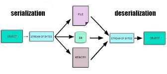

## Concept of Serialization

Serialization is translating an object like data structure into a format that can be easily stored, transmitted, or reconstructed later. The difference between just storing it as an object and storing on-disk: Think of a data structure like a binary tree, the nodes have pointers that point to scattered places in memory. To write it on disk we need to use a contiguous series of bytes rather than a long one with holes which would cause fragmentation. Therefore we need a way to serialize it into some bytes and then we can store it. This also means it has to be deserializable so we can retrieve it later. 

## Serialization in MerkleDB

## On-disk serialization in Firewood
See ava-labs/firewood/Storage/src/
